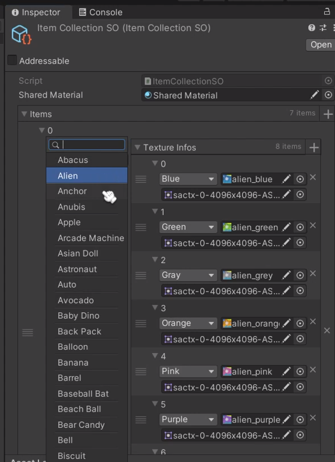
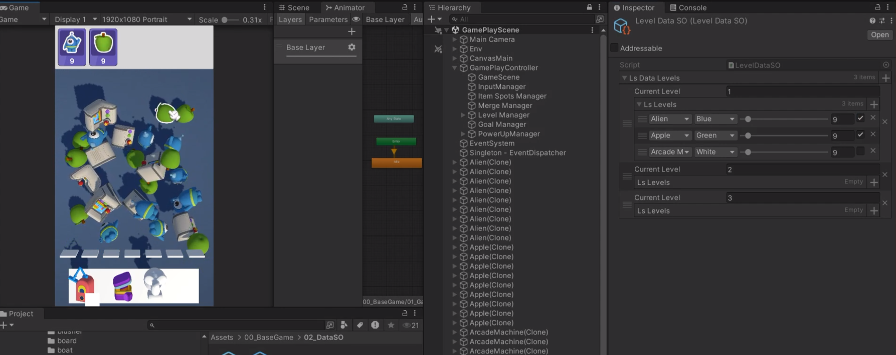

# This is a simple *clone* of Match Factory! by Peak Studio.
## It focuses on the core gameplay: matching items, using power-ups, and completing goals.

### 🎯 Gameplay
* Win/Lose Conditions, Goal tracking system.

### ⚡ 3 Power-Up Boosters:
* Vacuum: Sucks up 3 items in the level.
* Spring: Pushes one item off the shelf.
* Fan: Shuffles all items on screen.

### 📁 Data Setup:
 * Items Data:
    * Add item types (like apple, star, heart...).
    * Assign textures and icons for each item.
    * Used in goals and gameplay.
    * 

 * Levels Data:
    * Setup total number of items appearing in the level.
    * Choose which items are “goal items” by ticking checkboxes.
    * Each level can have different goals!.
    * ⦁	

